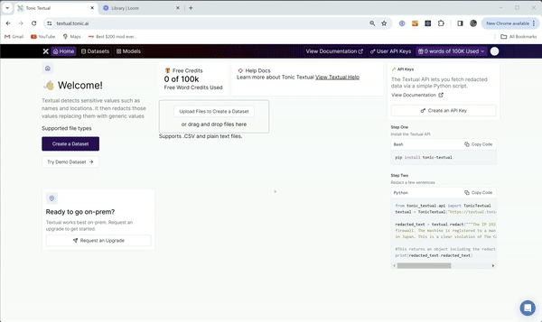

# How to use

Quick setup for using the Tonic Textual UDFs on Snowflake

### Get an API Key

Create a free Tonic Textual account at https://textual.tonic.ai.  And then create an API Key.




### Run udf_setup.sql

Fill out the values in udf_setup.sql.  You'll need to modify the value of **TEXTUAL_API_KEY** and enter in the API key created in the previous step.

*Note: If you've deployed Textual on your own server you'll need to modify the value of **TEXTUAL_BASE_URL** as well as the NETWORK RULE on line 22.*


Now run udf_setup.sql from your Snowflake IDE.

### Create some sample data for testing (optional)

You can optionally run sample_data.sql from your Snowflake IDE to create some sample data you can use for testing the UDF

### Sample usage

Ensure that you've already run sample_data.sql to create a **conversation** table with a few sample conversations for testing.

The Textual UDF can be run against individual strings or against a SQL result set.  For example, both queries work:

```
select udf_redact('<A string literal with sensitive information>')
```

Or, you can run the UDF against an entire column of conversational data.  The below query creates full conversations out of the snippts from the conversation table and then runs the UDF on each completed conversation

```
select
    conversation_id,
    real_convo,
    udf_redact(real_convo) as redacted_convo
from (
    select
        conversation_id,
        listagg(snippet, '\n') within group (order by ordering) as real_convo
    from
        conversations
    group by
        conversation_id
);
```
